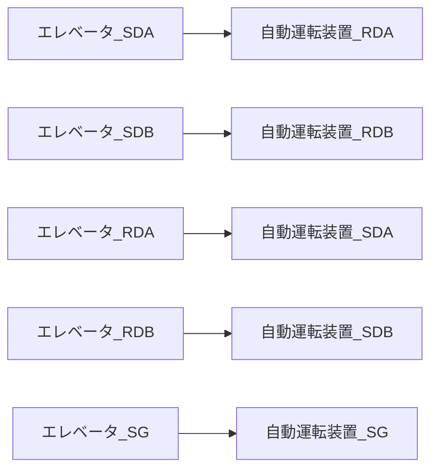
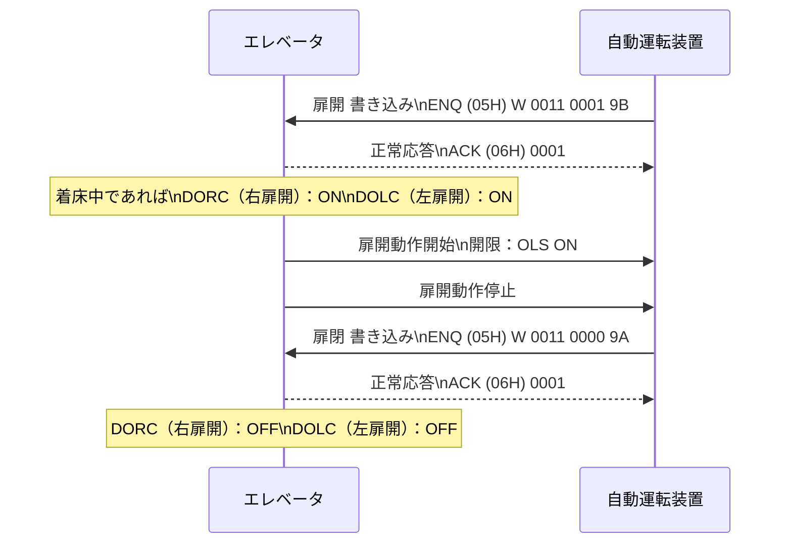
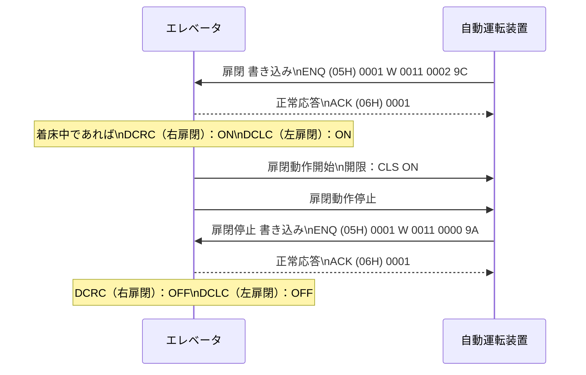
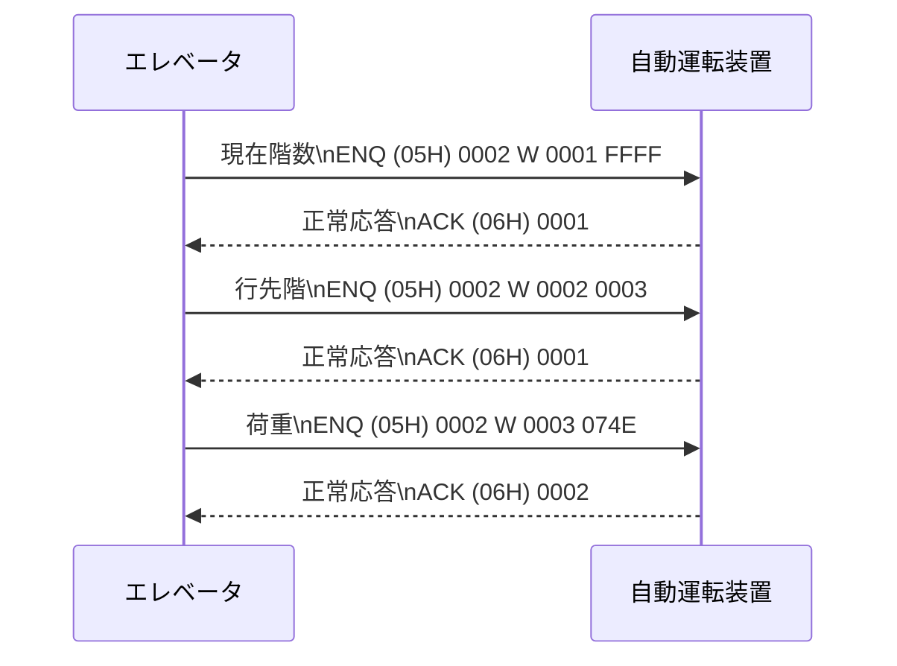

# 自動運転装置とエレベータ連携 構成図

## エレベータ側（左ブロック）

### ① 自動運転装置から取得（シリアル通信）

- 1. 現在の階数
- 2. 行先階
- 3. 荷重表示  
     ※SEL-2000 旧式機種：荷重宣言 無  
     ※SEC-3000 現行機種：荷重宣言 有

### ② 操作盤・機器動作回路から取得（I/O）

- I. 開限
- II. 閉限
- III. ケージ扉開
- IV. 昇降路扉開
- V. 着床
- VI. 昇降中（昇降ブレーキ動作）
- VII. 荷重
- VIII. 自動搬送モード

## 中央制御ブロック（搬器制御・操作盤・制御回路）

```mermaid
flowchart LR
  subgraph エレベーター搬器内
    A[自動運転装置基板]
    B[荷重検出器]
    A <-->|I/O| B
  end

  subgraph 搬器制御・操作盤 制御回路
    A <-->|"① シリアル通信\n（RS422）"| C[制御部]
    A <-->|"② I/O"| C
  end

  subgraph 地上制御盤・インバーター盤
    D[昇降用インバーター]
  end

  A <-->|I/O| D

  subgraph 客先準備機器
    C -->|無線またはキャリア| E[クラウドサーバー]
  end

  E <--> F[台車または水平台車]
```

## 客先準備機器（右ブロック）

- **クラウドサーバと通信**
- **無線または有線（キャリヤ）で通信可能**
- **台車または水平台車の構成もあり**

## 地上制御盤・インバーター盤（下部）


## 自動搬送制御指令（客先）

① 自動運転装置の入力信号
　（シリアル通信）

- 設定階数
- 扉開指令
- 扉閉指令

※非常停止信号追加

- 入力　 b 接点
- 出力　 b 接点

---

## 1. 通信仕様

| 項目     | 内容                     |
| -------- | ------------------------ |
| 通信規格 | RS422 4 線式、全二重通信 |
| 通信速度 | 9600bps                  |
| データ   | 8bit                     |
| パリティ | 偶数（even）             |
| ストップ | 1bit                     |

### 接続

2P 4 芯シールド付きツイストペアケーブルを使用してください。シールドは SG として接続してください。

#### 接続図（通信線結線）



### 通信周期

エレベータから自動運転装置へ書き込み  
データ番号 0001 ～ 0003 を順次送信して無制限に繰り返し送信します。

データ間隔　 wait 無し

送信終了後 0.3 秒待ち無応答の場合、8 回リトライ送信して  
8 回無応答の場合、次のデータ番号を送信します。

---

## 2. 電文フォーマット

### 2-1. データ書き込み要求伝文

#### エレベータから自動運転装置へ書き込み

| コントロールコード | 局番号     | コマンド | データ番号 | データ     | チェックサム |
| ------------------ | ---------- | -------- | ---------- | ---------- | ------------ |
| ENQ                | 10 進 4 桁 | W        | 10 進 4 桁 | 16 進 4 桁 | 16 進 2 桁   |
| 05H                | 0002       | W        | 0001       | FFFF       |              |

※ チェックサム範囲は局番号からデータまで

#### チェックサム出力範囲

チェックサムはサムチェックの対象となる範囲のデータを、バイナリデータとみなして加算した結果の下位 1 バイト（8 ビット）の値を 2 桁の 16 進表記

- 局番号　　　自動運転装置　　　 0002

#### 自動運転装置 → エレベータ へ書き込み

自動運転装置からエレベータへ書き込み

| コントロールコード | 局番号     | コマンド | データ番号 | データ     | チェックサム |
| ------------------ | ---------- | -------- | ---------- | ---------- | ------------ |
| ENQ                | 10 進 4 桁 | W        | 10 進 4 桁 | 16 進 4 桁 | 16 進 2 桁   |
| 05H                | 0001       | W        | 0011       | FFFF       |              |

- 局番号　　　エレベータ　　　　 0001

## 2-2. 正常応答伝文

### 自動運転装置からエレベータに応答

| コントロールコード | 局番号     |
| ------------------ | ---------- |
| ACK                | 10 進 4 桁 |
| 06H                | 0002       |

### エレベータから自動運転装置に応答

| コントロールコード | 局番号     |
| ------------------ | ---------- |
| ACK                | 10 進 4 桁 |
| 06H                | 0001       |

## 2-3. 異常終了伝文

### 自動運転装置からエレベータに応答

| コントロールコード | 局番号     |
| ------------------ | ---------- |
| NAK                | 10 進 4 桁 |
| 15H                | 0002       |

### エレベータから自動運転装置に応答

| コントロールコード | 局番号     |
| ------------------ | ---------- |
| NAK                | 10 進 4 桁 |
| 15H                | 0001       |

---

## 3. データ

### エレベータから自動運転装置（マイコン）への書き込み

| 番号 | 内容     | データ        |
| ---- | -------- | ------------- |
| 0001 | 現在階数 | B1F / FFFF    |
| 0002 | 行先階   | 3F / 0003     |
| 0003 | 荷重     | 1870Kg / 074E |

- 行先階は着床後データ 0 を書き込みます。　　　　（停止タイマー UP 後自動）
- 行先階が複数予約されているときは着床後次の行先階を書き込みます。
- 行先階と設定階が同一の場合、行先階は 0 を書き込みます。
- 設定階が最底階、最上階の範囲を超えた場合は行先階は 0 を書き込みます。

荷重データは昇降中、起動直前の荷重を維持します。

### 自動運転装置（マイコン）からエレベータへの書き込み

| 番号 | 内容     | データ        |
| ---- | -------- | ------------- |
| 0010 | 階数設定 | 3F / 0003     |
| 0011 | 扉制御   | 扉開閉 / 0001 |

#### 扉制御（bit 定義）

| ビット | 値  | 動作     | 備考                    |
| ------ | --- | -------- | ----------------------- |
| bit0   | 1   | 扉開開始 | 扉開: 0001 / 扉閉: 0002 |
|        | 0   | 扉開停止 |                         |
| bit1   | 1   | 扉閉開始 |                         |
|        | 0   | 扉閉停止 |                         |

扉は着床中のみ動作します。
開閉同期 ON は再動作を停止します。

エレベータ CPU 基板からは子機通信による扉開閉操作と同様の出力を使用します。

- 扉は途中動作中の分動作を中止します。
- 開閉同期の ON 出力が全停止します。
- エレベータ CPU は物理信号による開閉判断と同様の出力を使用。

| 出力信号名 | 内容   |
| ---------- | ------ |
| DCRC       | 右扉閉 |
| DCLC       | 左扉閉 |
| DORC       | 右扉開 |
| DOLC       | 左扉開 |

---

## 4. 扉制御

### 4-1. 扉開動作



### 4-2. 扉閉動作



### 備考

- 扉開閉コマンドは 0.3 秒以内に繰り返してください。
- 通信が途絶した場合、開閉動作は停止します。
- 通信が途絶した場合、開閉動作は停止します。
- 例文中のチェックサムは計算したものではありません。

---

## 5. 通常通信

### 通信フロー



### 注意事項

- 通信例中のスペースは実際の通信では挿入しないでください。
- 通信例中のチェックサムは計算したものではありません。

### 解説

- エレベータから自動運転装置へ繰り返し送信します。
- エレベータが書き込み中あるいは正常応答待ちの間に自動運転装置から書き込みが発生した場合でも、自動運転装置からの応答を待ちます。
- エレベータが書き込み中あるいは正常応答待ちの間に自動運転装置から書き込みが発生した場合、自動運転装置からの応答前に自動運転装置に応答することがあります。
