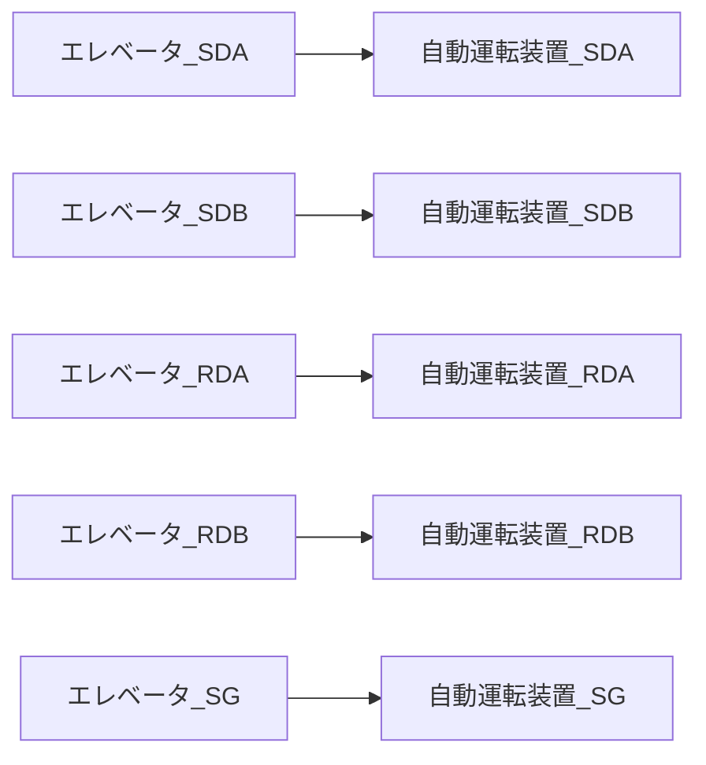
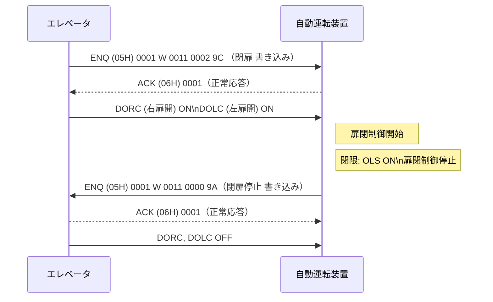
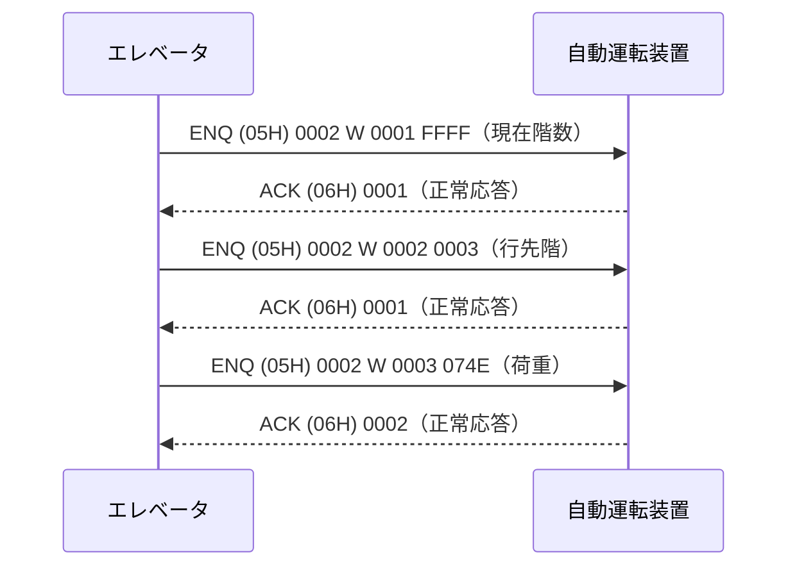

# 自動運転装置とエレベータ連携 構成図

## エレベータ側（左ブロック）

### ① 自動運転装置から取得（シリアル通信）

- 1. 現在の階数
- 2. 行先階
- 3. 荷重表示  
     ※SEL-2000 旧式機種：荷重宣言 無  
     ※SEC-3000 現行機種：荷重宣言 有

### ② 操作盤・機器動作回路から取得（I/O）

- I. 開床
- II. 閉床
- III. 扉一部開
- IV. 非常開
- V. 非常閉
- VI. 昇降中（昇降ブレーキ動作）
- VII. 着床
- VIII. 自動搬送モード

## 中央制御ブロック（搬器制御・操作盤・制御回路）

## 客先準備機器（右ブロック）

- **クラウドサーバと通信**
- **無線または有線（キャリヤ）で通信可能**
- **台車または水平台車の構成もあり**

## 地上制御盤・インバーター盤（下部）

## 自動搬送制御指令（客先から）

### 入力信号（シリアル通信）

- 設定階数
- 扉開指令
- 扉閉指令

※非常停止信号追加

- 入力 a 接点 / 出力 b 接点

---

## 1. 通信仕様

| 項目     | 内容                     |
| -------- | ------------------------ |
| 通信規格 | RS422 4 線式、全二重通信 |
| 通信速度 | 9600bps                  |
| データ   | 8bit                     |
| パリティ | 偶数（even）             |
| ストップ | 1bit                     |

### 接続

2P 4 芯シールド付きツイストペアケーブルを使用してください。シールドは SG として接続してください。

#### 接続図（通信線結線）

### 通信周期

- エレベータから自動運転装置へ書き込み
- データ番号 0001 ～ 0003 を順次送信して無制限に繰り返し送信します。

#### データ間隔

- `wait無し`
- 送信終了後、3 秒待ち無応答の時は、8 回リトライ送信して 8 回無応答の時点で終了
- 応答正常の場合、次のデータ番号を送信します。

---

## 2. 電文フォーマット

### 2-1. データ書き込み要求伝文

#### エレベータ → 自動運転装置 へ書き込み

| コントロールコード | 局番号 | コマンド | データ番号 | データ | チェックサム |
| ------------------ | ------ | -------- | ---------- | ------ | ------------ |
| ENQ (05H)          | 0002   | W        | 0001       | FFFF   |              |

#### チェックサム出力範囲

バイナリデータを加算した値の下位 1 バイト（8bit）と上位 1 バイト（8bit）の和を 16 進 2 桁で指定。

#### 自動運転装置 → エレベータ へ書き込み

| コントロールコード | 局番号 | コマンド | データ番号 | データ | チェックサム |
| ------------------ | ------ | -------- | ---------- | ------ | ------------ |
| ENQ (05H)          | 0001   | W        | 0001       | FFFF   |              |

## 2-2. 正常応答伝文

### 自動運転装置 → エレベータ に応答

| コントロールコード | 局番号 |
| ------------------ | ------ |
| ACK                | 0002   |
| 06H                |        |

### エレベータ → 自動運転装置 に応答

| コントロールコード | 局番号 |
| ------------------ | ------ |
| ACK                | 0001   |
| 06H                |        |

## 2-3. 異常終了伝文

### 自動運転装置 → エレベータ に応答

| コントロールコード | 局番号 |
| ------------------ | ------ |
| NAK                | 0002   |
| 15H                |        |

### エレベータ → 自動運転装置 に応答

| コントロールコード | 局番号 |
| ------------------ | ------ |
| NAK                | 0001   |
| 15H                |        |

---

## 3. データ

### エレベータから自動運転装置（マイコン）への書き込み

| 番号 | 内容     | データ        |
| ---- | -------- | ------------- |
| 0001 | 現在階数 | B1F / FFFF    |
| 0002 | 行先階   | 3F / 0003     |
| 0003 | 荷重     | 1870Kg / 074E |

- **行先階**: 乗客が選択しているまたは運転装置が指示した行先階を送信（停止タイマー UP 後自動送信）。
- **行先階重複**: 同一の場合は上書き、再度指示があれば上書き送信。
- **設定階無効時**: 最高階/最低階で再指示あればその行先階を送信。
- **荷重データ**: 原単位。起動前の荷重値を維持して送信。

### 自動運転装置（マイコン）からエレベータへの書き込み

| 番号 | 内容     | データ    |
| ---- | -------- | --------- |
| 0010 | 階数設定 | 3F / 0003 |
| 0011 | 扉制御   | 00 / 0004 |

#### 扉制御（bit 定義）

| bit0 | 意味     |
| ---- | -------- |
| 1    | 開扉開始 |

| bit1 | 意味     |
| ---- | -------- |
| 1    | 閉扉開始 |
| 0    | 閉扉停止 |

- 扉は途中動作中の分動作を中止します。
- 開閉同期の ON 出力が全停止します。
- エレベータ CPU は物理信号による開閉判断と同様の出力を使用。
  - `DCRC`: 右扉開
  - `DCLC`: 左扉開

---

## 4. 扉制御

### 4-1. 扉開動作

### 4-2. 扉閉動作

### 備考

- 扉開閉コマンドは 3 秒以内に繰り返してください。
- 通信エラーが発生した場合、開閉動作は停止します。
- 通信例内のスペースは実際の通信では挿入しないでください。
- 通信中のチェックサムは計算したものではありません。

---

## 5. 通常通信

### 通信フロー

### 注意事項

- 通信例中のスペースは実際の通信では挿入しないでください。
- 通信例中のチェックサムは計算したものではありません。

### 解説

- エレベータから自動運転装置へ繰り返し送信します。
- 書き込みがあれば正常応答待ちの間に自動運転装置から書き込みが発生しても、
  エレベータは自動運転装置からの応答を待ちます。
- 同様に、自動運転装置が書き込み中であっても正常応答待ちの間に
  エレベータから書き込みが発生した場合、自動運転装置はその応答前に通信相手に応答することがあります。
